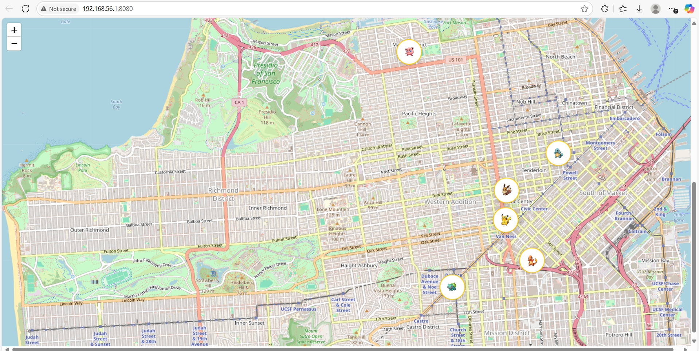

# API-Driven Scavenger Hunt





## Overview

The API-Driven Scavenger Hunt is an innovative web application that transforms real-world exploration into a fun, gamified experience. By leveraging geolocation and Pokémon data, users embark on a scavenger hunt to discover virtual treasures (Pokémon) tied to physical locations. This prototype showcases a sleek frontend with top-tier UI/UX design, setting the stage for an engaging adventure.

## Problem Statement

In today’s digital age, people often lack motivation to explore their surroundings. Traditional activities may feel mundane, leaving a gap for creative, tech-driven solutions to inspire adventure and discovery.

## Solution

This app gamifies exploration by integrating real-world locations with a scavenger hunt framework. Users interact with a map, uncover clues, and reveal Pokémon fetched via APIs, blending physical movement with digital rewards. The prototype focuses on a stellar frontend experience, making exploration intuitive and delightful.

## APIs Used

- **PokeAPI (GraphQL):** Fetches Pokémon data efficiently. Example query:

```graphql
query {
  pokemon(name: "pikachu") {
    name
    image
  }
}
```

- **Leaflet.js/OpenStreetMap:** Renders an interactive, open-source map for hunt navigation.
- **Browser Geolocation API:** Centers the map on the user’s location for a personalized experience.

## Prototype Features

- **Interactive Map:** Displays the user’s location and six hunt points using Leaflet.js and custom Pokémon markers.
- **Geolocation:** Centers the map on the user’s position (defaults to San Francisco if denied).
- **Marker Interaction:** Clicking a marker opens a card-style modal with a typewriter clue, Pokémon image, type icon, and description.
- **Pokémon Card Design:** Sleek modal with gradient, shadow, and a “Caught!” badge. Type icons for each Pokémon.
- **Progress Dashboard:** Fixed bottom bar shows animated progress (e.g., "2/6 Pokémon found").
- **Theme Toggle:** Light/dark mode toggle with Tailwind CSS for beautiful theming.
- **Gamified Feedback:** Confetti and sound effect when a Pokémon is found.
- **Responsive Design:** Mobile-first layout, vibrant colors, and subtle animations.
- **Branding:** Subtle Pokémon logo watermark overlay on the map.

## UI/UX Design

The prototype prioritizes a clean, intuitive interface:

- **Mobile-First:** Full-screen map with overlay modals, optimized for small screens.
- **Visual Feedback:** Typewriter clues, confetti, and vibrant progress bar for engagement.
- **Simplicity:** Clear clues and bold Pokémon displays guide users effortlessly.
- **Responsiveness:** Adapts seamlessly to desktop and mobile devices.
- **Theme Flexibility:** Light/dark mode for accessibility and style.

## Future Roadmap

- **Real Geolocation Triggers:** Require users to physically approach hunt points.
- **Expanded Challenges:** Add more hunt points and dynamic clues.
- **Multiplayer Mode:** Enable friends to compete or collaborate.
- **Scoring System:** Introduce points and leaderboards for gamification.
- **Offline Support:** Cache map data for uninterrupted play.

## Setup Instructions

1. **Clone the Repository:**

   ```sh
   git clone <repository-url>
   ```

2. **Install a Local Server (optional, recommended):**

   ```sh
   npm install -g http-server
   ```

3. **Run the Prototype:**
   - Navigate to the project directory:
     ```sh
     cd <project-folder>
     ```
   - Start the server:
     ```sh
     http-server
     ```
   - Open [http://localhost:8080](http://localhost:8080) in your browser
   - Alternatively, open `index.html` directly (note: some features may require a server).

4. **Allow Location Access:**
   - Grant permission when prompted to center the map on your location.

## Screenshots

- Dashboard: 
- Map: 
- Modal: 

This prototype is a strong foundation for a scalable, exciting application. Contributions and feedback are welcome to take it further!